#  Digital Twin Toolbox

Docker solution for inspecting data and 3D Tiles generation for urban environment.

**Important**: The application **is not** production ready. The main purpose of the current setup is a local development environment to produce 3D Tiles.

## Setup

Navigate in a directory and clone the repository

```bash
git clone https://github.com/geosolutions-it/digital-twin-toolbox
```

Navigate in the cloned `digital-twin-toolbox` repository

```bash
cd ./digital-twin-toolbox
```

Copy the `.env.sample` and rename it to `.env`, this file include the default variable to initialize the application

### Environment variables

name | description | default
--- | --- | ---
DEVELOPMENT | if `true` enable the watch listener to rebuild the client and server on file changes | false
NGINX_PORT | the webapp port | 3000
POSTGRES_USER | postgres user | postgres
POSTGRES_PASSWORD | postgres password | postgres
POSTGRES_DB | postgres database | postgres
POSTGRES_HOST_AUTH_METHOD | trust method is needed to work with `pg2b3dm` library | trust

Start the application with

```bash
docker-compose up
```

After the docker containers are running is possible to access the client at: [http://locahost:3000](http://locahost:3000)

## Add data

The page [http://locahost:3000](http://locahost:3000) shows a webapp with the following structure:

- 3D viewer on the background
- An interactive form on the top right corner
- A logging dialog box on the top left corner (visible only when accessing data)

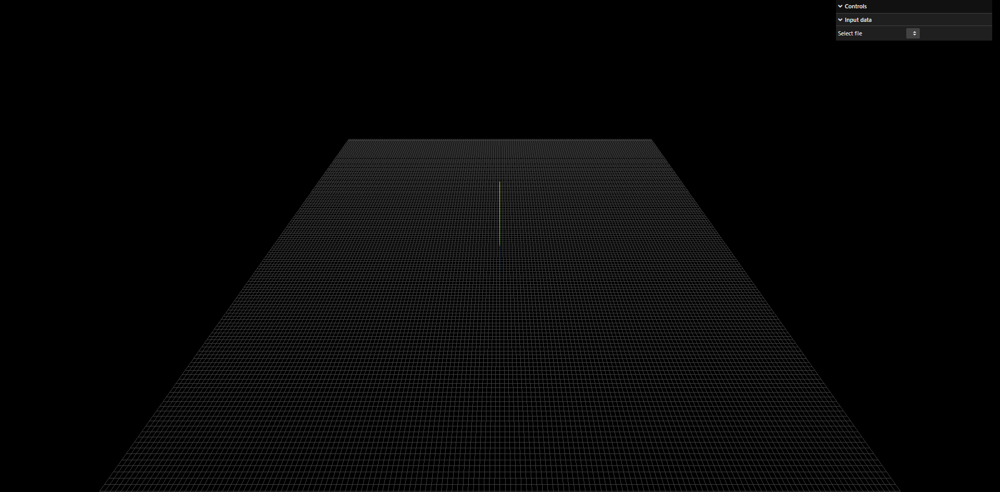

The interactive form shows a select box at intialization that allows to select the data to process. After the first setup this select is empty because there is not data provided in the appliacation.

The data can be included directly inside the folder `static/data` provided inside this repository. The data supported are:

- `Vector data` shapefile in .zip folder
- `Point cloud data` .las files
- `Mesh data` (Experimental) .ply files generated from the .las files

The select box will be populated with options after adding the files inside the `static/data` and refreshing the [http://locahost:3000](http://locahost:3000) page

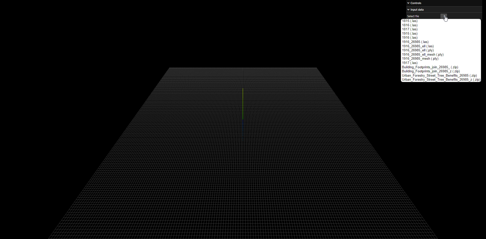

## Processing data

This application provides different workflows based on the input data: vector, point cloud or mesh.

### Vector polygons processing

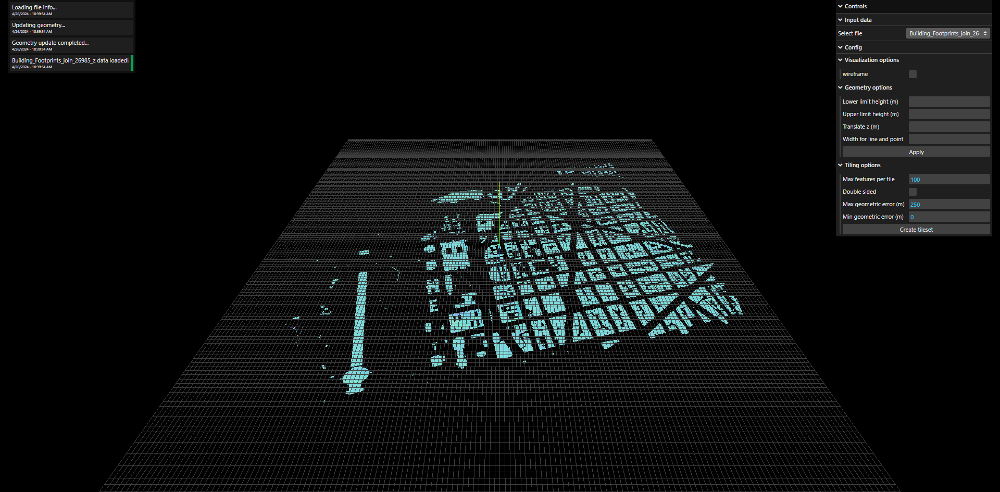

The vector polygon processing initializes when a shapefile in a .zip folder is selected, the interactive form lists the following sections:

- **Visualization options** allows to change how geometry are rendered in the 3D view, this has not effect on the output tileset. Properties:
    - `Wireframe` shows the rendered gemetry with a wireframes style

    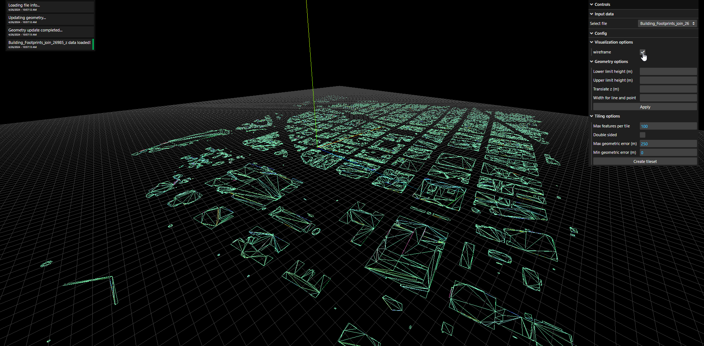

- **Geometry options** allows to modify the input geometry. Properties:
    - `Lower limit height (m)` lower limit in meter of generated extruded geometry. It can use expression
    - `Upper limit height (m)` upper limit in meter of generated extruded geometry. It can use expression
    - `Translate z (m)` translate all the geometry along the z axis for the given distance in meter. It can use expression
    - `Width for line and point` width in meter for line geometries. It can use expression
    - `Apply` action button to apply all the above properties to the geometry

    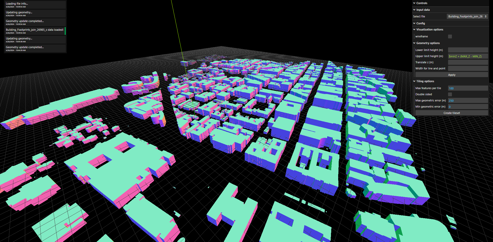

- **Tiling options** allows to create a 3DTiles output based on the previewed data. Properties:
    - `Max features per tile` number of maximum features per tile
    - `Double sided` shading option for the generated mesh files inside the tileset
    - `Max geometric error (m)` maximum geometric error, used to define when the tileset will be visible based on the distance from the camera
    - `Min geometric error (m)` minimum geometric error, used to define when the tileset will be visible based on the distance from the camera
    - `Create tileset` action to initialize the creation of tileset based on the above properties

    

### Vector point processing

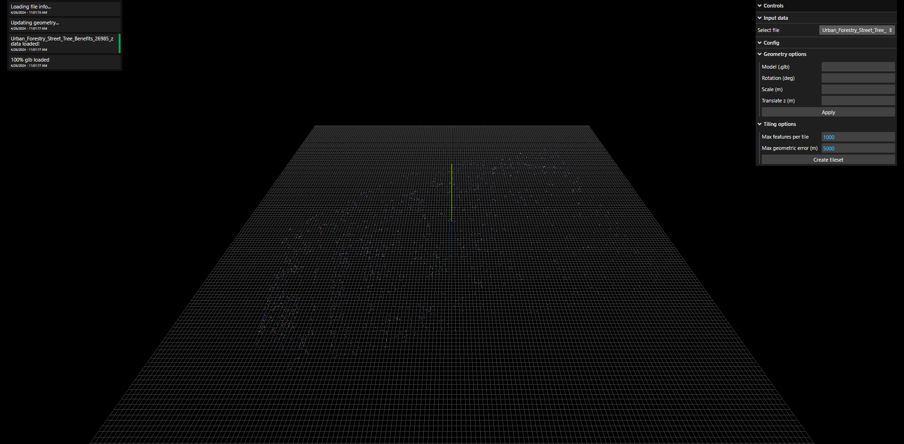

The vector point processing initializes when a shapefile in a .zip folder is selected, the interactive form lists the following sections:

- **Geometry options** allows to modify the input geometry. Properties:
    - `Model (.glb)` the name of a .glb model provided inside the `static/glb` folder. It can use expression
    - `Rotation (deg)` the rotation of the model in degrees. It can use expression
    - `Scale (m)`the scale of the model in meter. It can use expression
    - `Translate z (m)` translate all the geometry along the z axis for the given distance in meter. It can use expression
    - `Apply` action button to apply all the above properties to the geometry

    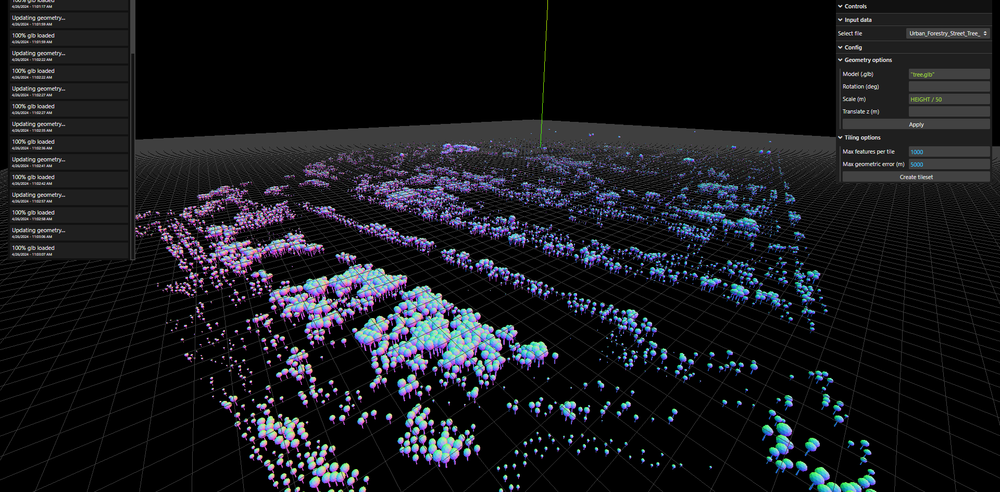

- **Tiling options** allows to create a 3DTiles output based on the previewed data. Properties:
    - `Max features per tile` number of maximum features per tile
    - `Max geometric error (m)` maximum geometric error, used to define when the tileset will be visible based on the distance from the camera
    - `Create tileset` action to initialize the creation of tileset based on the above properties

    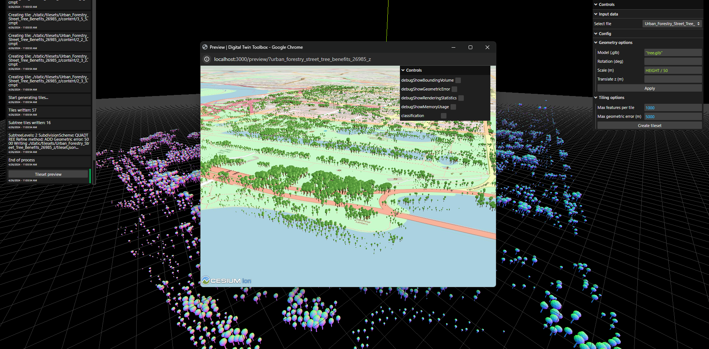

### Point cloud processing

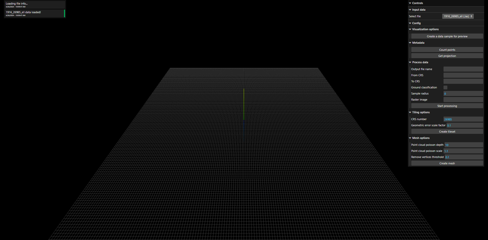

The point cloud processing initializes when a .las file is selected, the interactive form lists the following sections:

- **Visualization options** creates a preview for the selected data. Properties:
    - `Create a data sample for preview`

    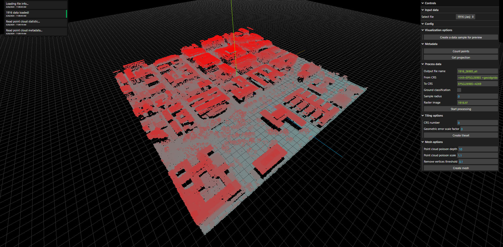

- **Metadata** allows to retrieve some information from the selected data. Properties:
    - `Count points` action that returns the counts of points of the selected data
    - `Get projection` action that return the horizontal and vertical projection of the selected data

- **Process data** allows to process the selected data and it creates a new .las file that could be processed separately. Properties:
    - `Output file name` name of the new .las file
    - `From CRS` the projection of the current selected data
    - `To CRS` the target projection for the conversion
    - `Ground classification` apply the ground classification
    - `Sample radius` reduce the point cloud based on a radius in meter
    - `Raster image` the name of a raster image available in `static/data` that could be used to colorize the point cloud
    - `Start processing` action to initialize the creation of a new point cloud based on the previous properties

- **Tiling options** allows to create a 3DTiles output based on the previewed data. Properties:
    - `CRS number` authority number of the coordintanates system of the selected data (eg EPSG:26985 -> 26985)
    - `Geometric error scale factor` a factor to adjust the default geometric error generated by the process. This value is applied to all the geometricError in the tileset.json with by multiplication
    - `Create tileset` action to initialize the creation of tileset based on the above properties

    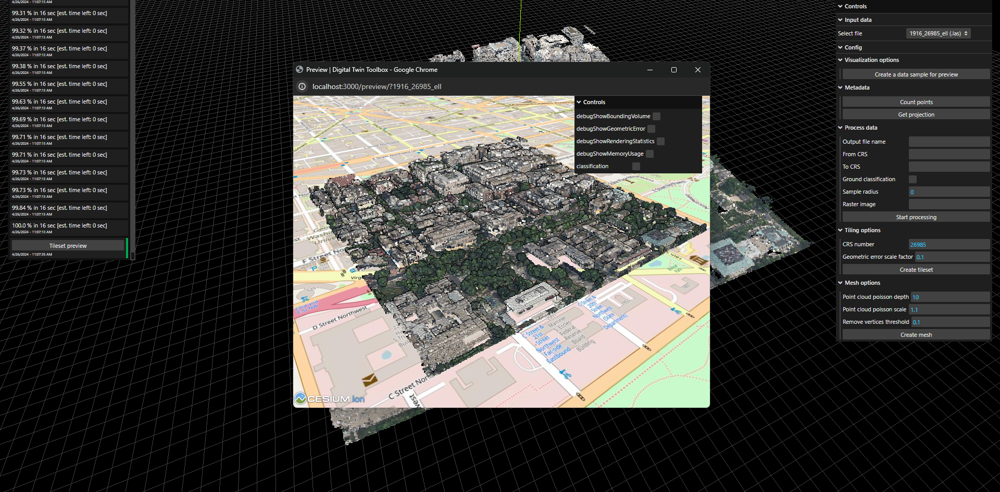

- **Mesh options** allows to create a mesh output in .ply format based on the previewed data. Properties:
    - `Point cloud poisson depth` the depth value to apply to the poisson surface reconstruction
    - `Point cloud poisson scale` the scale value to apply to the poisson surface reconstruction
    - `Remove vertices threshold` a threshold value between 0 and 1 to remove vertices far away from the point cloud based on density value generated by the poisson surface reconstruction process
    - `Create mesh` action to create a mesh based on the above selected properties

### Mesh processing (Experimental)


**Note: this process is still a work in progress**

The mesh processing initializes when a .ply file is selected, the interactive form lists the following sections:

- **Visualization options** creates a preview for the selected data. Properties:
    - `Create a data sample for preview`

    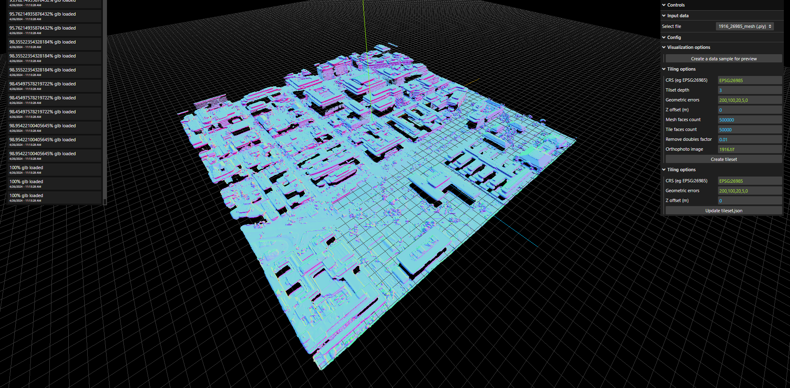

- **Tiling options** allows to create a 3DTiles output based on the previewed data. Properties:
    - `CRS` coordinate reference system of the center of the mesh
    - `Tileset depth` subdivision depth of the tileset (2^depth)
    - `Geometric errors` list of geometric errors to apply to the generated tileset.json
    - `Z offset (m)` translate all the mesh along the z axis for the given distance in meter
    - `Mesh faces count` expected maximum count of faces for the imported .ply mesh
    - `Tile faces count` expected maximum count of faces for each tile
    - `Remove doubles factor` factor value to reduce the count of faces based on the matrix level of the tileset
    - `Orthophoto image` a image to be used as texture, if this is missing the value for vertex color will be used
    - `Create tileset` action to initialize the creation of tileset based on the above properties

- **Tileset.json options** allows to update the tileset.json if already available. Properties:
    - `CRS` coordinate reference system of the center of the mesh
    - `Geometric errors` list of geometric errors to apply to the generated tileset.json
    - `Z offset (m)` translate all the mesh along the z axis for the given distance in meter
    - `Update tileset.json` action to update the tileset.json based on the above properties

    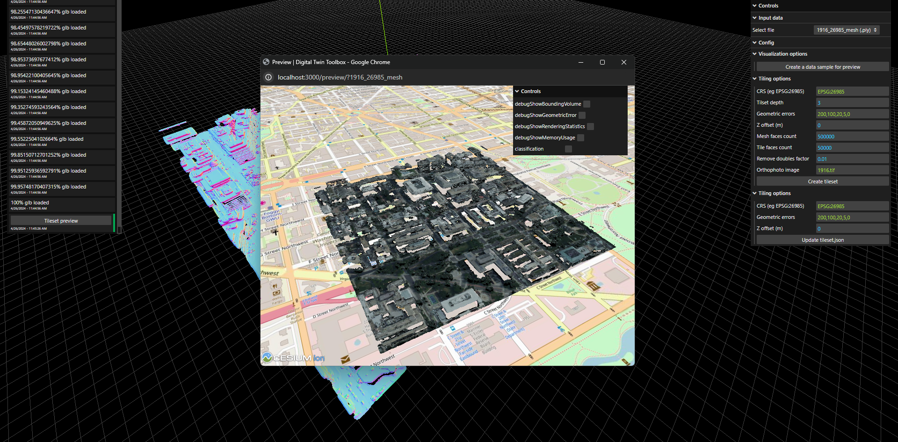

## Generated tileset

All the generated tileset are located in the `static/tilesets` folder of this repository and they can be previewed at the following link:

`http://locahost:3000/preview/?{name-of-the-tileset}`
